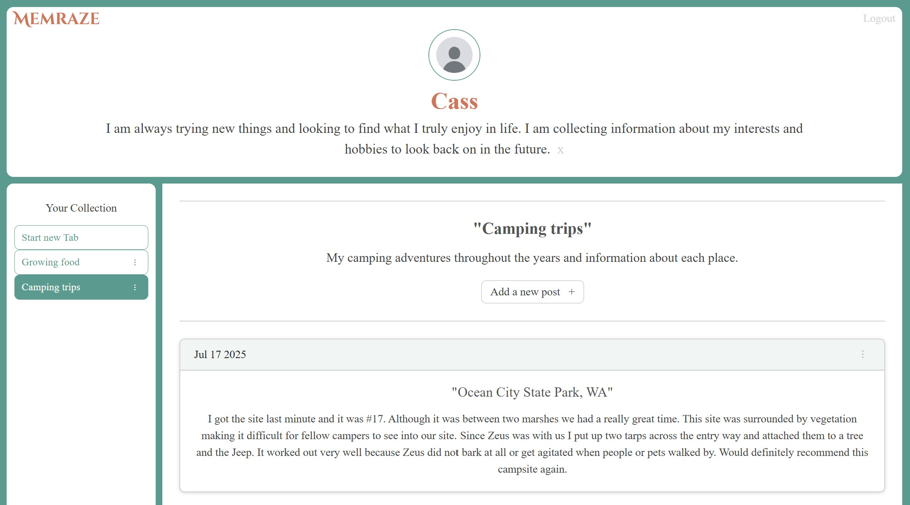

# [Memraze](https://youtu.be/3zuAoxVZfMk)
Want to keep a record of all of your interest/hobbies, the good and the bad, all in one place? Memraze has exactly what you need. Try it out for yourself!

## Table of Contents
* [Motivation](#motivation)
* [Features](#features)
* [Tech Stack](#tech-stack)
* [Installation](#installation)
* [How to Use](#how-to-use)
* [Future Plans](#future-plans)
* [Project Status](#project-status)
## Motivation
I wanted to create an app where someone could store information about their interests, and be able to look back on it to see what may or may not have worked in the past. It allowed me to create authentication by utilizing tokens and storing them in the backend cookies and work with MongoDB.
## Features
- **Create a profile** - Add description for your profile and summarize the content that will be or is on your profile
- **Keep Track of Personal Interests/Hobbies** - Add and manage tabs for each interest/hobby and create and manage posts within each one
- **Full CRUD Functionality** - Create, read, update, and delete descriptions, tabs and posts
- **Secure Authentication** - Uses **JWT** with encrypted passwords and cookies for safe, persistent sessions
## Tech Stack
- **Frontend**: HTML5, CSS, Javascript, React, Bootstrap
- **Backend**: Node.js, Express.js, Javascript
- **Database**: MongoDB
- **Authentication**: JWT with encrypted passwords and cookies
## Installation
1. Clone the repository:
     ```bash
     git clone https://github.com/ScriptSculptorJS/Memraze.git
3. Install dependencies for both client and server:
     ```bash
     npm install
     cd frontend
     npm install
5. Set up your .env file in the root directory with the following:
     ```bash
     MONGO_URI=your_mongodb_uri
     JWT_SECRET=your_jwt_secret
7. Start the development servers:
     ```bash
     cd ..
     npm run start
## How to Use
- **Sign Up/Login to create your account**
- **Make a personal description for your profile**
- **Create tabs with their title, description, and posts**
- **Manage your tabs and post lists using the edit and delete features**

## Future Plans
1. Make it so the user can add a profile image and photos within a post.
2. Make it so they can see other user's profiles and tabs.
3. They can follow profiles or just tabs.
4. See those people and/or tabs in their left navbar that currently contains their tabs list so they can easily click the link to see them.
5. Can take it even further, but the main point is that if they follow a person or tab that user does not have to follow back. It is all very intentional.

## Project Status
Completed for now, but can be iterated upon in the future
